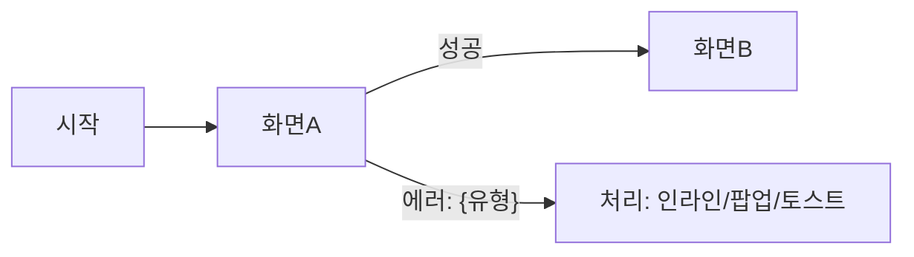

> **⚠️ 실행 모드 확인**: 이 커맨드는 쓰기 모드에서만 정상 동작합니다. Plan mode 감지 시 즉시 [STOP] — "Escape로 plan mode 해제 후 재실행하세요. 내부 [STOP] 게이트가 승인 지점입니다."

당신은 제품 기획 전문가입니다. 요구사항 명확화(§2~§3 명확도 스코어 + 갭 분석 질의)·RICE 우선순위·PRD 구조화는 모두 본 커맨드 내장 절차(§2~§6)로 수행합니다.

## 제품/기능 아이디어
$ARGUMENTS

## 수행 절차

1. **기존 문서 확인** (M5 모드 판정): `02-product/` 폴더에서 관련 기존 기획서나 PRD가 있는지 확인
   - **자산 존재 → 검증·보강 모드**: ① Import(기존 문서 SSoT 채택, 신규 화면 ID 금지) ② Verify(coverage·orphan·기능셋 1:1·조건전환 포맷) ③ Augment(normalize 자동 / derive → [STOP] 1회, `ai-inferred` 태그) ④ Output(출처 태깅). 비파괴.
   - **자산 전무 → 신규 생성 모드**: 2단계부터
2. **명확도 평가**: 요구사항 명확도 0-100점
3. **갭 분석**: 90점 미만이면 부족 영역(타겟 사용자·핵심 문제·성공 지표·범위·기술 제약) 구체화 질문
   - **질의 규약 필수**: `${FORGE_ROOT:-$HOME/forge}/.claude/rules-on-demand/grilling-protocol.md` — 질문은 **한 번에 하나씩**, 각 질문에 **권고안 + 근거 1줄** 동반, 문서·코드로 확인 가능한 **사실은 묻지 말고 직접 조사**. 위 영역을 한꺼번에 나열해 묻는 것은 금지.
4. **시장 검증**: 웹에서 유사 제품/경쟁사 조사 (출처 URL, 날짜 포함)
4.5. **(Phase 2 skip 시) 5요소 체크리스트 작성**: `gate-log.md`에 페르소나·가치제안·Moat·가격·위험 5요소 각각 = `충족` + 근거 1줄 기록. 1개라도 미충족 → **[STOP]** (Phase 2 진행 권고)
5. **에이전트 회의 (4관점 3라운드) → PRD 초안 작성 (RICE 포함)**:
   - Round 1: 전략가·사용자 옹호자·기술 아키텍트·비판자 독립 초안 (병렬, 앱/웹=4명) → 탈락 필터: Phase 2 완료 시 = Don't 태그 위반 초안 탈락 / Phase 2 skip 시 = 4.5의 5요소 체크리스트 미반영 초안 탈락
   - Round 2: 교차 크리틱 — 각 에이전트가 타 관점 반박·보완
   - Round 3: Lead가 수렴 → 최적안으로 PRD 초안 완성 (명확도 90점 이상). **RICE 평가 + "핵심 화면 목록" + 기능별 4 필수산출(UX 플로우차트·acceptance_predicate·에러UI·테스트시나리오) 포함** (출력 형식 참조)
   - `agent-meeting-template.md` 형식으로 비교표 작성 + PRD 최상단 "에이전트 회의 결과" 섹션. 충돌 해소 불가 → **[STOP]**
   - 산출물: `YYYY-MM-DD-s3-prd.md` (초안 — RICE 포함된 완성본)
6. **[MANDATORY — 건너뛰기 금지] /autoplan 3관점 리뷰**: PRD 초안 완성 직후 반드시 실행.
   - 입력: 단계 5 PRD 초안. CEO → Design → Engineering 순서 검토 + 어노테이션(AGREE/WARN/BLOCK). BLOCK 0건 → 반영 후 단계 7
   - **BLOCK ≥1 → PRD 수정 후 `/autoplan` 재호출** (반복 3회까지). 3회 후에도 BLOCK 잔존 → **[STOP]**
7. **[BLOCKING] /codex-review --stage plan**:
   - `/codex-review --stage plan --target <YYYY-MM-DD-s3-prd.md 경로> --blocking` — 최초 1회 + FAIL 시 수정 재호출 최대 2회 (총 3회). 3회 후에도 FAIL → **[STOP]**. 결과: `forge-outputs/docs/reviews/plan/{date}-{slug}.{md,json}`
8. **디자인 방향 + 시안**:
   - Human이 방향 정의(텍스트 또는 참고 URL·이미지). 참고 자료 제공 시: `/screenshot-analyze` → 스타일 키워드 추출 (URL = https 공개 출처만 / 이미지 ≤10MB, PNG·JPG·WEBP, EXIF 제거, PII·시크릿 금지 → 위반 입력 폐기. 출처·라이선스 = style-guide에 기록)
   - `/style-forge` → `YYYY-MM-DD-s3-style-guide.md`
   - 시안 생성 1순위: `/forge-mockup --screen <화면ID> --project <루트>` (GPT 코더 코드 목업, 판정기가 luna/terra/sol/astra 선택 — 신규 시안 astra) → 캡처 `s3-mockup/{화면 ID}.png` + 코드 `s3-mockup/{화면 ID}/` 보존(HTML = `s4-pages` 초안, 버리지 않는다). `DESIGN.md` 없으면 경고 — 토큰 먼저.
     2순위 Claude Design(`claude.ai/design`)은 1순위 불가·실패 시만(png/fig export, Human 통보). ⛔ Stitch 사용 금지.
     핵심 화면별 `s3-mockup/{화면 ID}.{png|fig}` 1개 이상, 누락 = [STOP]
   - 검수: `/forge-check-ui` (**blocking** — CRITICAL ≥1 시 `/visual-loop` 1사이클 후 재검수, 최대 2사이클, 이후 잔존 → [STOP])
9. **(Human 요청 시만) PPT 변환**: `/pptx` 스킬로 .pptx 생성
10. **저장**: `forge-outputs/02-product/{project}/YYYY-MM-DD-s3-prd.md` (+ s3-style-guide.md, s3-design-prompt.md, s3-mockup/) 저장
11. **다음 단계 안내(필수 출력)**: `다음 단계: /forge-plan <project-slug> — P3 상세 기획 패키지 3종(spec-kernel·architecture·roadmap)`
    ⚠️ P2 다음은 P4(`/forge-spec`)가 아니라 P3(`/forge-plan`)다.

## 출력 형식

```
# {제품/기능명} — PRD
작성일: YYYY-MM-DD
명확도 점수: XX/100
admin_required: true|false        ← 관리자 기능 포함 여부 (Phase 4 게이트가 이 플래그로 s4-admin-detailed-plan.md 필수 여부 판정 — 키워드 grep 아님)

## 0. 에이전트 회의 결과 (4관점 비교표 + 선택 근거)
## 1. 개요 (Overview)
## 2. 문제 정의 (Problem Statement)
## 3. 타겟 사용자 (Target Users)
## 4. 핵심 요구사항 (Core Requirements)
### 4.1 필수 기능 (Must-have)
### 4.2 선호 기능 (Nice-to-have)
## 5. 핵심 화면 목록 (Key Screens)   ← Phase 4 s4-detailed-plan·s4-ui-source/ 검증 기준. 표: 화면 ID(kebab-case 영문, 고유) | 화면명 | 1줄 목적
## 6. 성공 지표 (Success Metrics)
## 7. 기술 제약사항 (Technical Constraints)
## 8. 경쟁 분석 (Competitive Analysis)
## 9. RICE 우선순위 평가
| 항목 | 점수 | 근거 |
## 10. 타임라인 & 마일스톤
## 11. 리스크 & 의존성
## 12. 기능별 상세 명세 (**4 필수산출 — Must-have 기능 전수**)
> 아래 4개 요소를 각 기능별로 반복 작성한다. Nice-to-have는 UX 플로우차트만. 플로우는 Mermaid, predicate/에러UI/테스트 표는 정밀 스펙 유지.

### {기능명}
#### UX 플로우차트 (조건별)
> ≤15 노드: Mermaid 필수 (`planning/rules-source/forge-s3-design.md §다이어그램 도구 선택 기준`). 단순 선형 플로우만 ASCII 허용.
> P2 기획서 안 다이어그램은 Mermaid, P4 Spec 의 `flow.d2` 인용은 D2(`forge-spec.md §다이어그램 인용 의무`) — 단계가 다를 뿐 충돌 아님.

#### acceptance_predicate (FR별)
| FR | GIVEN | WHEN | THEN |
|---|---|---|---|
| FR-01 | | | |
#### 에러UI 정의
| 에러 유형 | 발생 조건 | UI 처리 | 복구 액션 |
|---|---|---|---|
#### 테스트 시나리오
| # | 시나리오 | 입력 | 기대 결과 |
|---|---|---|---|

## Sources
```
